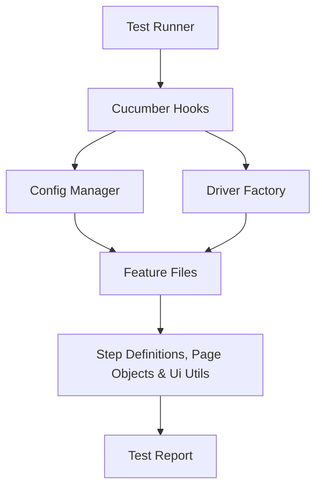

# Manage ToDo List Test Automation
This project is designed to automate the UI test scenarios for "Manage ToDos" Application. The tests are designed based on the User Story and Acceptance Criteria(AC).

AUT: https://todomvc.com/examples/react/dist/

User Story: As a user, I should be able to manage my todos effectively.

Acceptance Criteria (AC):
* Add new todo item
* Mark the item as completed
* Edit the item
* Remove the item
* ToDo list filters (All, Active and Complete)
* Clear completed item
* Toggle-all to change the items status

Note : The detailed ACs (Test Scenarios) are present in the [feature file](src/test/resources/features/ManageTodoList.feature)

## Tech Stack
* Language : Java (v17+)
* Build Tool : Maven
* BDD Framework : Cucumber
* Browser Automation Tool : Selenium WebDriver
* Test Runner and Assertions : TestNG

## How to Run

### 1. Prerequisites
1. JAVA (v17 or later)
2. Maven: To handle all the project dependencies
3. Git: To clone the repository

### 2. Clone the repository
  ```
  git clone https://github.com/bburhan123/todo-test-automation.git
  ```

### 3. Install Dependencies: Navigate to project directory and run the below command
  ```
  mvn clean install
  ```

### 5. Run Tests
* To run all the tests with default config (chrome):
   ```
   mvn test
   ```

* To run the specific test:
   ```
   mvn clean test -D cucumber.options.tag="@test-1"
   ```

## Test Report

* Cucumber HTML Report will be generated in the following path - target/cucumber-reports/cucumber.html

## Implementation Strategy

This project is implemented using Cucumber with TestNG, Page Object Model with Selenium Page Factory design pattern and configuration-driven approach with a focus on clean code and industry standards design patterns.

### 1. Project Structure
* Core components:
  
  The components are organized under src/test/java and src/test/resources
    * Feature Files - Test scenarios are written in Gherkin syntax with focus on behaviour of the application
    * Step Definitions - Implement the test scenarios using code
    * Page Objects - Represent the Page Elements locators and respective actions
    * Utils - Contain reusable browser helper methods
    * ConfigManager - To manage the external configuration from config.yml
    * DriverFactory - For WebDriver creation and management
    * CucumberHooks - Test scenario lifecycle handling(Setup / TearDown)
    * TestRunner - TestNG Runner to drive the Cucumber execution
    * Report - Using the out of box Cucumber HTML report

### 2. Execution Flow

